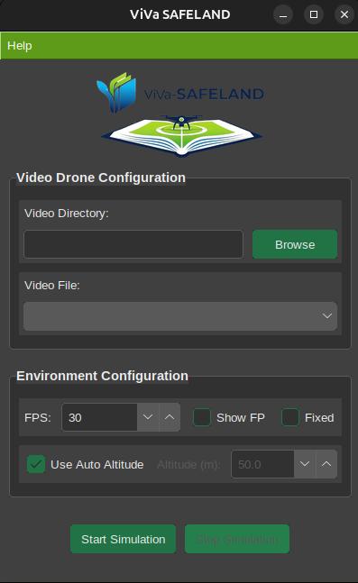
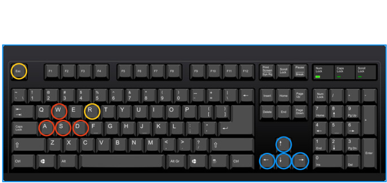
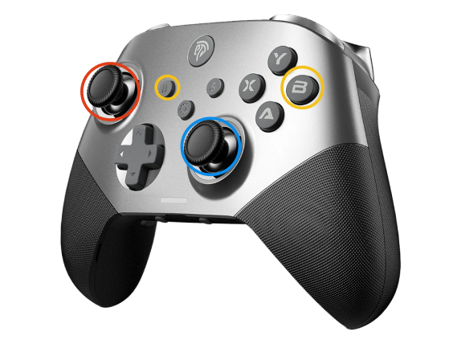

# Usage Guide

This guide will walk you through a basic example of how to use ViVa-SAFELAND.

First, make sure you have the [necessary dependencies installed](installation.md). Then, you can run the simulation directly from your terminal

## Quick Start
### Graphical User Interface (GUI)
You can start the simulator with this command line:

```bash
uv run viva
```

{ width="400" align="right" }

This command will start a GUI where you can configure the simulation parameters:

- Video Drone Configuration:
    - Video Directory: This is the directory where your video files are located.
    - Video File: This is the specific video file you want to use for the simulation.
- Environment Configuration:
    - FPS: This is the frames per second setting for the simulation (default is 30).
    - Show FPS: If set, the FPS will be displayed on the terminal.
    - Fixed: If set, the background will be only the first frame of the video sequence.
    - Use Auto Altitude: If set, the initial altitude will be automatically determined from the video metadata (*.SRT file), default is `True`.
    - Altitude: If you don't have the `.SRT` file or you want to specify a different altitude, you can use this option, this option is enabled when `Use Auto Altitude` is unchecked.
- Simulation Control:
    - Start: Begin the simulation with the configured parameters.
    - Stop: Stop the simulation.

### Command Line Interface (CLI)

Alternatively, you can run the simulator specifying the options directly in terminal, this method does not activate the GUI.

```bash
uv run viva "/path/to/your/drone_video.mp4"
```

### Options
You can customize the simulation as in the GUI with the options:

- `--help`: Show info about the usage of viva.
- `--render-fps <fps>`: Set the frames per second for rendering (default is 30).
- `--fixed`: If set, the background will be only the first frame of the video sequence.
- `--rel-alt-value <initial_altitude>`: Set the initial relative altitude of the drone in meters. If not provided, it will be extracted from the video metadata or SRT file.
- `--show-fps-flag`: If set, the FPS will be displayed on the terminal.

**Example with options:**

```bash
viva "/path/to/your/drone_video.mp4" --render-fps 60 --fixed --rel-alt-value 80 --show-fps-flag
```

## Controls
You can start to move the drone with the `keyboard` or a `joystick` if you connect one. The default controls are:

=== "Keyboard Controls"
    { width="600" align="right" }

    <span style="color: red;"><b>Thrust and orientation</b></span>

    - **W/S**: Increase/Decrease Thrust
    - **A/D**: Yaw anticlockwise/clockwise

    <span style="color: blue;"><b>Movement</b></span>

    - **Up/Down Arrow**: Move Forward/Backward
    - **Left/Right Arrow**: Move Left/Right

    <span style="color: gold;"><b>Special Actions</b></span>

    - **R**: Reset drone state
    - **Esc**: Exit from the simulation

=== "Joystick Controls"
    { width="480" align="right" }

    <span style="color: red;"><b>Thrust and orientation</b></span>

    - **Left Stick Up/Down**: Increase/Decrease Thrust
    - **Left Stick Left/Right**: Yaw anticlockwise/clockwise

    <span style="color: blue;"><b>Movement</b></span>

    - **Right Stick Up/Down**: Move Forward/Backward
    - **Right Stick Left/Right**: Move Left/Right

    <span style="color: gold;"><b>Special Actions</b></span>

    - **BACK button**: Reset drone state
    - **B button**: Exit from the simulation

    !!! info "Note"
        The controls of the joystick are universally mapped, so the positions of the sticks and buttons are the same for all joysticks. 

## Application Usage
If you want to use `viva` to develop your own application, you can use the `DroneEnv` class from the `viva` package. Below is a minimal example of how to use it:

=== "render_mode=human"

    ```python title="Minimal usage example" linenums="1"
    from viva import DroneEnv

    # Create an instance of the simulator environment
    env = DroneEnv(
        render_mode="human", 
        video="<path_to_your_video_file>.MP4",
    )

    # Initialize the environment with a random drone pose
    obs, info = env.reset()
    terminated = False

    # Main loop to run the simulation
    while not terminated:
        action = [0.0, 0.0, 0.0, 0.0]               # Example: no action
        obs, terminated, info = env.step(action)
    ```

=== "render_mode=rgb_array"

    ```python title="Minimal usage example" linenums="1" hl_lines="2 18-22"
    from viva import DroneEnv
    import cv2

    # Create an instance of the simulator environment
    env = DroneEnv(
        render_mode="rgb_array", 
        video="<path_to_your_video_file>.MP4",
    )

    # Initialize the environment with a random drone pose
    obs, info = env.reset()
    terminated = False

    # Main loop to run the simulation
    while not terminated:
        action = [0.0, 0.0, 0.0, 0.0]               # Example: no action
        obs, terminated, info = env.step(action)
        img = env.render()                          # Get the RGB array
        cv2.imshow("environment", img)              # Display the image
        if cv2.waitKey(1) == 27:                    # Exit on 'ESC' key
            break
    cv2.destroyAllWindows()
    ```

!!! tip "Useful information"
    `obs` is a RGB array representing the **current drone view** and one of the most important outputs of the environment, you can treat it as an image and apply your computer vision algorithms on it.
The full documentation of the `DroneEnv` class can be found in the [API reference](api.md).

### Example with Controller
To add a controller to the drone you can import the HMI class from the `viva` package and use it to control the drone with a keyboard or joystick. Below is an example of how to integrate the controller:

```python title="Adding a Controller" linenums="1" hl_lines="2 10 11 19 21-24"
    from viva import DroneEnv
    from viva import HMI

    # Create an instance of the simulator environment
    env = DroneEnv(
        render_mode="human", 
        video="<path_to_your_video_file>.MP4",
    )

    # Create an instance of the HMI controller
    hmi = HMI()

    # Initialize the environment with a random drone pose
    obs, info = env.reset()
    terminated = False

    # Main loop to run the simulation
    while not terminated:
        action, reset, terminated_command = hmi()
        obs, terminated, info = env.step(action)
        terminated = terminated or terminated_command
        if reset:
            obs, info = env.reset()
    hmi.quit()
```

For full documentation of the `HMI` class, see the [API reference](api.md).